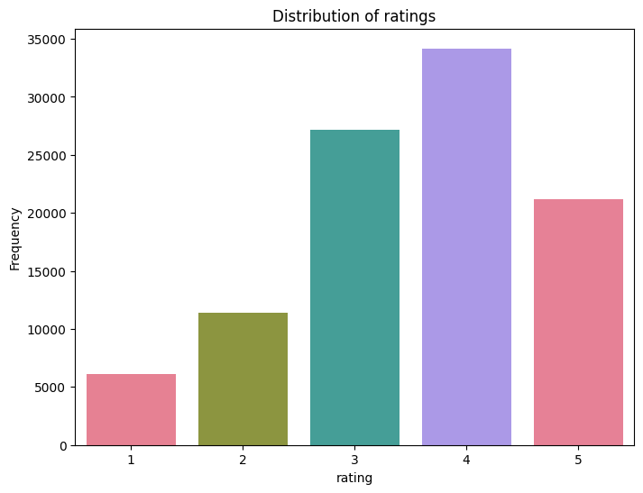
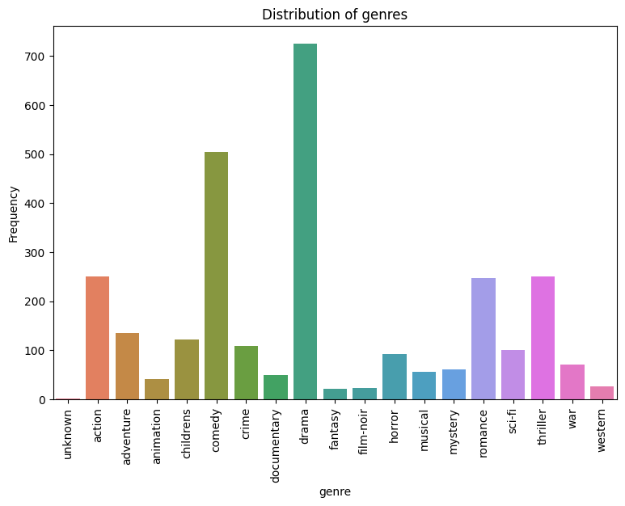
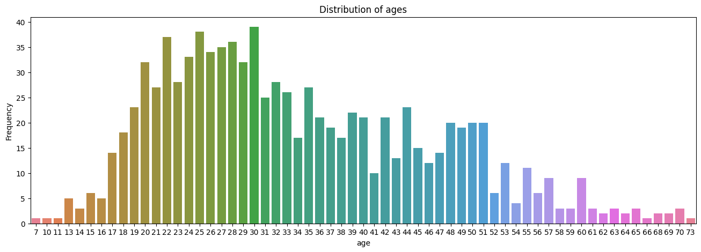
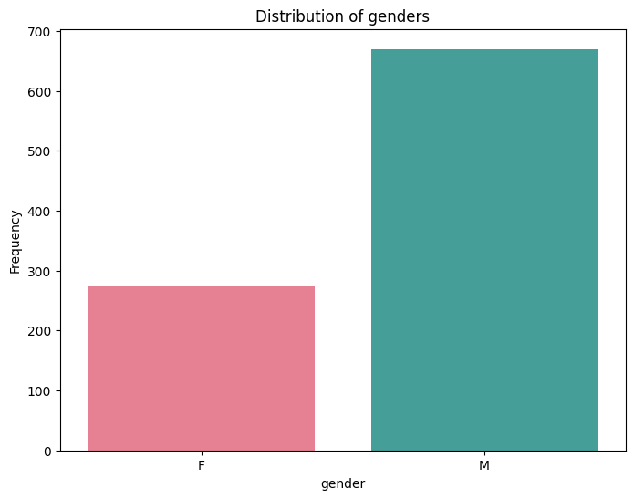
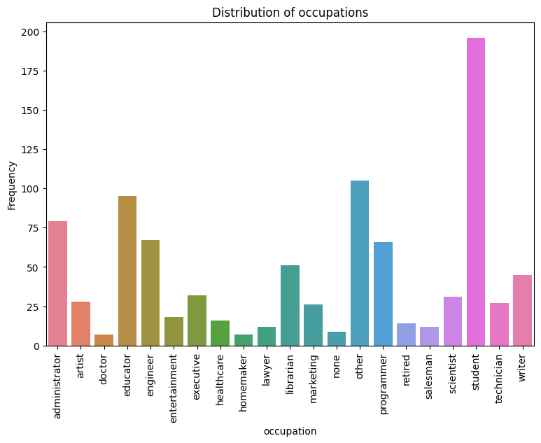

# Report 

## Introduction

This report provides an overview and analysis of the Movie Recommender System developed as part of Assignment 2. The purpose of this system is to recommend movies to users based on their preferences and historical data. In this report, I will discuss the data analysis, model implementation, model advantages and disadvantages, training process, evaluation, and the results obtained.

## Data Analysis

The data analysis phase involved exploring and understanding the dataset used. First of all, the key notes about data from MovieLens: in the main dataset there are iformation about 943 users and 1682 movies. Moreover, in all datasets users and movies ids start from 1 (not from 0). 

Let's consider the data exploration visualizations and results: 

Figure 1 shows the distribution of movie ratings in the dataset. It can be observed that the majority of ratings fall within the range of 3 to 5, indicating that users generally rate movies positively.

Figure 2 illustrates the genre distribution of movies in the dataset. It shows that the most common genres are `Drama` and `Comedy`, while `Unknown` and `Fantasy` are the least popular genres.

Figure 3 displays the distribution of user ages. It indicates that the majority of users fall within the age range from 17 to 35.

According to the Figure 4, there is a higher proportion of male users compared to female users.

The most common activity of rating movies is among students (See Figure 5).

To sumup, the data analysis phase provided valuable insights into the dataset, which helped in understanding the characteristics of the data about movies and users.

## Model Overview, Advantages and Disadvantages

The Alternating Least Squares (ALS) is a collaborative filtering algorithm commonly used for recommendation systems. It is particularly effective when dealing with large and sparse datasets. The ALS algorithm is a type of matrix factorization that aims to factorize the user-item interaction matrix into two lower-rank matrices: one representing the users' preferences and the other representing the items' attributes.

The ALS model used for recommendation systems has several advantages and disadvantages:

### Advantages:
- Effective for large and sparse datasets;

- Simplicity in implementation (thanks `implicit` library) and very fast training.

### Disadvantages:
- Cold start problem, when making accurate recommendations for new users or items with limited interaction data challenging;

- Lack of interpretability;

- Sensitivity to hyperparameters, such as the number of latent factors, regularization factor, and number of iterations. 

## Model Implementation

To implement the ALS model, I use [implicit library](https://benfred.github.io/implicit/index.html). They already provided the model, which aims to learn a binary target of whether each user has interacted with each item - but weights each binary interaction by a confidence value that in our case can be a rating. The implementation in implicit uses the values of a sparse matrix to represent the confidences, with the non zero entries representing whether or not the user has rated the movie. So, before using the model, I transformed the raw input data from `ua.base` (train) and `ua.test` (test) datasets to a sparse matrices. The next steps will be provided in the Training Process and Evaluation.

## Training Process and Evaluation

After completing the data preprocessing, I tuned the hyperparameters of the ALS model. These hyperparameters include the number of latent factors to compute (`factors`), the regularization factor (`regularization`), and the number of iterations to use when fitting the data (`iterations`). I experimented with different combinations of these parameters and evaluated each model on a test set using the metrics MAP@10 and NDCG@10. Also, I computed the Precision@10 score for the evaluation. Then, based on the evaluation results, I found the best model with the following parameters:
- `factors`: 30;
- `regularization`: 1.0;
- `iterations`: 200.

The evaluation metrics for this model on test set are as follows:

- Precision@10: 0.2549;
- MAP@10: 0.1531;
- NDCG@10: 0.2899.

## Results

The ALS model, with the tuned hyperparameters, demonstrates its effectiveness in generating relevant recommendations based on the user preferences. Also, it can predict the similar movies or users. For instance, upon making some examples, I found that when the model predicts 10 similar movies to 'The Lion King', it suggests movies like 'Home Alone', 'Bedknobs and Broomsticks', 'The Parent Trap', and 'Fly Away Home', which I personally believe would be relevant choices to watch after 'The Lion King'. Other examples you can see at the very bottom of the last notebook.